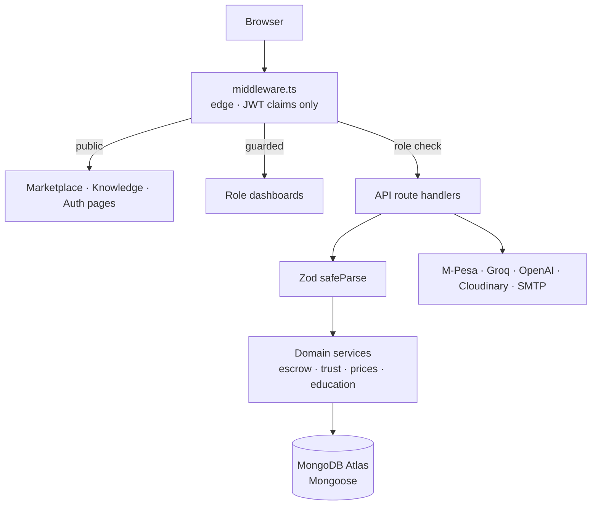

# UmojaHub — Technical Interview Script

**A script you read while operating the application.** It opens with the problem, walks a
person who has never used UmojaHub through creating an account, then hands the platform to
users who have been on it for months.

**Version:** 2026-08-22 · rebuilt around the registration flow
**Supersedes:** `PRESENTATION_SPEECH.md` and the *Demo Flow* section of `PRESENTATION_GUIDE.md`
as the interview narrative. `PRESENTATION_GUIDE.md` remains the reference for troubleshooting
and environment setup.

### How the labels work

| Label | Meaning |
|---|---|
| **[SAY]** | Read aloud. Written to be spoken, not recited. |
| **[RUN]** | Type this in the terminal. |
| **[CLICK]** | Do this in the browser. |
| **[SHOW]** | Open this file if they want to see the code. |
| **[WHY]** | The technical explanation — say it if they look interested, skip it if they don't. |
| **[IF ASKED]** | A question they are likely to ask, and the answer. |
| **[EXPECT]** | What should appear. If it doesn't, see §21. |

### Verification status of everything in this document

Every claim was checked against the running application on 2026-08-22.

- **Walked live in a browser:** registration, validation failures, duplicate email, role
  selection, the details step, landing on the farmer dashboard, the verification lockout,
  role enforcement (lecturer redirect, admin 404), sign-out, sign-in, and the database row
  that resulted.
- **Verified by the automated suite** (all green, run this session): 1,513 unit tests across
  122 suites, and 55 end-to-end tests against a real production build and a real database —
  including checkout, escrow, farmer orders, admin payouts and mediation, lecturer review,
  and peer review.
- Nothing in this document is described from memory or intention. Where a limit exists, §21
  names it.

---
---

# SECTION 1 — Problem statement

**[SAY]**

> Before I open anything, I want to start with the problem, because the software only makes
> sense once you can see the thing it is arguing with.
>
> A smallholder farmer in Kenya grows food and cannot reliably find out what it is worth.
> The buyer is three or four intermediaries away. Each one takes a margin, and each one knows
> more about the price than the farmer does. The farmer's information about the market is
> whatever the person standing in front of their gate tells them, and that person is the
> person buying.
>
> The second half of the problem is on the other side of the same transaction. A buyer — a
> restaurant, a school, a distributor — wants to source directly. They can't, because they
> have no way to tell a real farmer with real stock from someone who will take a deposit and
> disappear. So both sides keep the middleman, not because he adds value, but because he is
> the only thing either of them can verify.
>
> That is one problem with two faces: **there is no trusted channel between the person who
> grows food and the person who buys it.** Not a missing app. A missing basis for trust.

**[SAY]**

> There is a second problem I care about for a different reason, and it is why this platform
> has two halves.
>
> A Kenyan computer science student graduates having written a great deal of code and having
> built almost nothing. The degree is theoretical by design. The practical experience employers
> ask for is supposed to arrive through internships that mostly do not exist at the scale
> needed. So a student finishes four years of study with a transcript and no evidence.
>
> Those two problems live in the same country and, it turns out, in the same platform — because
> the marketplace is a real system with real money and real users, which is exactly the kind of
> thing a student has no other way to work on.

---

# SECTION 2 — Problem in perspective

**[SAY]**

> Let me make that concrete, because the abstract version is easy to nod along to.
>
> Wanjiku farms three acres at Mwea. Tomatoes and capsicum under drip irrigation, rice on the
> scheme. She harvests, and a broker comes to the farm and offers her a price. She has no way
> to know whether that price is fair this week. She can't call five buyers in Nairobi, because
> she doesn't have five buyers in Nairobi — the broker does. She takes the price, because the
> tomatoes will not wait.
>
> A hundred kilometres away, a restaurant in Nairobi is buying those same tomatoes at roughly
> three times what she was paid. The restaurant is not gouging anybody. That gap is what it
> costs to move produce through a chain where nobody trusts anybody, so everybody has to be
> paid to take a risk.
>
> Now suppose Wanjiku could list directly. The first thing the restaurant asks is: *who is
> this?* Send money to a stranger with a phone number, and hope? That is a worse deal than the
> broker, not a better one. Disintermediation on its own doesn't solve anything — you have to
> replace the middleman's actual function, which was being the one party both sides could hold
> responsible.
>
> So the question this platform has to answer is not "how do we connect farmers and buyers."
> Connecting them is easy. It is: **how do you make it safe for two strangers to trade.**

---

# SECTION 3 — The UmojaHub solution

**[SAY]**

> UmojaHub answers that with three things, and they are the whole product.
>
> **First, identity is checked by a person.** Before a farmer can publish produce for sale, they
> submit an identity document and an administrator reviews it. Not an automated check, not a
> checkbox — a human being looks at it. That is slow and it does not scale beautifully, and it
> is deliberate: the verified badge means something precisely because a person put their name
> to it.
>
> **Second, money is held, not sent.** When a buyer pays, the funds go into escrow. The farmer
> can see the money is committed and starts fulfilling. The buyer's money doesn't leave escrow
> until the buyer confirms what actually arrived. If something goes wrong, either side can
> escalate and an administrator decides where the funds go. That is the middleman's function —
> being accountable — rebuilt as a system rule instead of a person's reputation.
>
> **Third, history is public and earned.** Every completed order feeds a trust score. A farmer
> who delivers builds something a new buyer can read before deciding.
>
> And on the education side: the Education Hub gives CS and IT students real engineering work
> against real briefs, with a lecturer acting as an engineering mentor — architecture review,
> code review, milestones, a weighted demonstration — rather than only as a grader.

**[IF ASKED] — "Isn't this just an e-commerce site?"**

> An e-commerce site optimises for the transaction. This optimises for the *conditions* under
> which a transaction is safe. Most of the code is not about buying and selling — it is
> verification, escrow state, trust scoring, dispute mediation, and payout settlement. The
> shopping cart is the small part.

---

# SECTION 4 — Platform overview

**[SAY]**

> There are six roles, and the platform is really four surfaces.

| Surface | Who | What they do |
|---|---|---|
| **Marketplace** | Farmers, Buyers | List produce, search, order, pay into escrow, confirm receipt, rate |
| **Trust & money** | Farmers, Buyers, Admin | Verification queue, escrow states, disputes, payout requests, ledger |
| **Education Hub** | Students, Lecturers, Institutions | Project briefs from academic context, mentor review, peer review, demonstrations |
| **Intelligence** | Farmers, Buyers | Price recommendations from real history, market insights, an AI farm assistant |

> The six roles are **Farmer, Buyer, Student, Lecturer, Admin, Institution**. Four of those —
> farmer, buyer, student, lecturer — are roles a person can choose for themselves when they
> sign up. **Admin and Institution are not.** I'll come back to that, because it is the security
> decision I would most want to be asked about.

---

# SECTION 5 — Architecture

**[SAY]**

> It's one Next.js application. Not a frontend calling a separate backend — one deployment that
> serves both the pages and the API, which for a platform this size is the right shape.



**[SAY]**

> Every API route follows the same four steps, in the same order, without exception:
> **connect to the database, get the session, check the role, validate the input with Zod.**
> Only then does it touch data. That is not a convention I hope people follow — there is a
> contract test that reads every route file and fails the build if one of them authenticates
> in none of the accepted ways without being explicitly declared public with a written reason.

**[SHOW]** `src/__tests__/contracts.test.ts` — the `PUBLIC_API_ROUTES` registry.

**[SAY]**

> Authorization happens twice, on purpose. The middleware runs at the edge and decides from JWT
> claims alone — no database read on a page load, which matters when your users are on 3G. Then
> every API route re-checks with `requireRole`, because a middleware that can be bypassed by
> calling the API directly is decoration.

**[IF ASKED] — "Why check twice? Isn't that duplication?"**

> They're answering different questions. The middleware answers "should this person see this
> page" and has to be fast. `requireRole` answers "is this person allowed to perform this
> operation" and has to be *right*. If I had to delete one, I'd delete the middleware — it's the
> optimisation. The route check is the security boundary.

---

# SECTION 6 — Technology stack, and why

**[SAY]**

> I'll go through these quickly, but I want to give a reason for each one rather than a list.

| Layer | Choice | Why this one |
|---|---|---|
| Framework | **Next.js 15** (App Router), React 19 | One deployment for pages *and* API. Server components mean the client downloads less, which is the whole game on a slow connection. |
| Language | **TypeScript 5**, strict, zero `any` | `@typescript-eslint/no-explicit-any` is set to `error`, so it's enforced in CI, not aspired to. |
| Database | **MongoDB** + Mongoose 9 | Roles carry genuinely different data — a farmer has crops and acreage, a student has a registration number and a GitHub handle. Embedded role sub-documents fit that without five nullable join tables. |
| Auth | **NextAuth v4**, JWT strategy | Mature, handles OAuth and credentials in one place, and JWT sessions are stateless — which matters on serverless where there is no session store to share. |
| Validation | **Zod 4**, `safeParse` on every route | One schema is simultaneously the runtime check and the TypeScript type. The same object validates on the server *and* guides the form on the client, so they cannot disagree. |
| Payments | Provider abstraction: `simulation` \| `daraja` | The simulator reproduces M-Pesa's actual state machine, including the failure modes. Switching to real Daraja is an environment variable, not a code change. |
| Styling | **Tailwind 3** + semantic design tokens | Components consume semantic tokens, never raw colours, so a theme is a re-mapping of values rather than a fork. |
| Testing | **Jest** + Testing Library, **Playwright** | Unit tests for logic and schemas; Playwright for the journeys that only exist when the whole stack is running. |
| Hosting | **Vercel** | Git-integration deploys; the platform's serverless model is what the DB connection singleton and lazy model imports are built around. |

**[IF ASKED] — "Why MongoDB and not Postgres?"**

> Honest answer: for the marketplace half, Postgres would have been at least as good, and
> arguably better for the money paths where I'd like real transactions. I chose MongoDB for the
> role modelling and the education records, which are genuinely heterogeneous and still
> evolving. If I were starting again with what I know now, I'd think harder about it — the
> escrow logic is the part that would benefit most from real relational constraints.
>
> That's the sort of trade-off I'd rather state plainly than defend.

---

# SECTION 7 — Exact setup commands

Run these **before** the interviewer arrives, not during.

### 7.1 One-time, after a fresh clone

**[RUN]**
```bash
npm install
```
**Purpose:** installs dependencies.
**When:** after a clone, or after `package.json` changes.
**[EXPECT]** completes with no `ERR!` lines. Node 20+ (verified on v24.16.0).

**[RUN]**
```bash
cp .env.local.example .env.local
```
**Purpose:** creates the environment file.
**When:** once.
**[EXPECT]** you must then fill it in. `src/lib/env.ts` throws at startup if a required variable
is missing, so a missing key fails immediately and loudly rather than at the moment you demo
the feature that needs it.

> **`MONGODB_URI` is not in the example file** — add it by hand. This is a known gotcha and it
> is documented in `CLAUDE.md`.

### 7.2 Before every rehearsal and before the interview

**[RUN]**
```bash
npm run demo
```
**Purpose:** builds the entire demonstration world and verifies it.
**When:** the last thing you do before presenting. See §8 for exactly what it deletes.
**[EXPECT]** roughly **3 to 6 minutes**, ending with:
```
[demo] all 73 checks passed.
[demo] demo world ready in 180.3s.
[demo] demo accounts (sign in with the email or the username):
  FARMER   wanjiku.kamau@gmail.com   Farmer@2024!   Primary farmer...
```
If it ends with `FAILED validation`, **do not present that world** — read the failing check and
run it again.

**[RUN]**
```bash
npm run dev
```
**Purpose:** starts the development server.
**When:** after the world is built.
**[EXPECT]** `http://localhost:3000`. Note the app has **no `/` route** — the public marketing
site is a separate concern — so open `/auth/login` or `/marketplace`, not the bare root.

### 7.3 Verification commands (see §18)

```bash
npm run type-check    # tsc --noEmit
npm run lint          # ESLint
npm test              # Jest — unit + integration
npm run test:e2e      # Playwright — full stack, own DB, own port
npm run build         # production build
```

Full reference table in §25.

---

# SECTION 8 — Database and seed process

**[SAY]**

> I want to be exact about this, because "I ran the seed script" is a sentence that hides a lot.

### What `npm run demo` does, in order

1. **Deletes every previously generated demo world.** Each world records a manifest of every
   document it created; the reset walks that manifest and deletes exactly those documents.
2. **Clears leftovers from the retired seed script** — matched against an explicit list of demo
   account emails.
3. **Clears orphaned records** — anything whose owner no longer exists.
4. **Clears the sign-up and sign-in throttles** in Redis, so a rehearsed registration doesn't
   leave the form rate-limited when it matters.
5. **Clears the reserved rehearsal account** (`mercy.wairimu@gmail.com`) so the live
   registration in §10 works every single time.
6. **Generates a fresh world**, runs the analytics cron jobs, then validates it with 73
   cross-record invariant checks.

### What it does **not** do

> **It never drops a collection and never issues an unscoped delete.** If that database also
> held genuine user data, that data would survive — it is not in any run's ledger, so it is
> physically unreachable by the reset. It also refuses to run at all when `NODE_ENV=production`.

**[IF ASKED] — "So does running the seed wipe my database?"**

> It wipes exactly what it created, plus four explicitly named things: the retired seed
> accounts, orphans, the auth throttles, and one reserved demonstration email. Everything else
> is untouched, by construction rather than by care.

**[SHOW]** `scripts/demo/reset.ts` — the comment at the top states this as the contract, and
`clearRehearsalAccounts` is deliberately driven by an explicit list rather than a pattern.

**[IF ASKED] — "Why is there a hard-coded email in your reset script?"**

> Because the registration demonstration creates a real user through the real form, and that
> user is not part of the generated world — nothing in the ledger points at it, so nothing in
> the reset could see it. It would survive into the next build, and the second rehearsal would
> hit "an account with this email already exists" at exactly the moment I'm demonstrating that
> registration works.
>
> I made it an explicit named list rather than a pattern like "delete recent signups" on
> purpose. This is the only path in the whole reset that can delete a user who signed up for
> themselves, so it must never be able to match somebody the runbook has not named.

---

# SECTION 9 — Demonstration accounts

Print this table any time with **`npm run demo:accounts`**.

### The one account that does *not* exist yet

| | |
|---|---|
| **Name** | Mercy Wairimu |
| **Email** | `mercy.wairimu@gmail.com` |
| **Password** | `Shamba2026!` |
| **Role** | Farmer (chosen live, on screen) |
| **County** | Nyeri |
| **Phone** | `0722114466` |
| **Purpose** | **Created live during the demonstration.** Cleared by every `npm run demo`. |

### Accounts the seed creates

Every one signs in with **email or username**, plus the password below.

| Role | Email | Password | What it demonstrates |
|---|---|---|---|
| **Farmer** ⭐ | `wanjiku.kamau@gmail.com` | `Farmer@2024!` | Verified, high trust. The main farmer story. |
| Farmer | `chebet.koech@gmail.com` | `Farmer@2024!` | **Verification PENDING** — approve her live from the admin queue. |
| Farmer | `kipchoge.mutai@gmail.com` | `Farmer@2024!` | Different crop mix and county (Uasin Gishu). |
| Farmer | `achieng.odhiambo@gmail.com` | `Farmer@2024!` | Smallholder with aquaculture. |
| Farmer | `njoroge.mwangi@gmail.com` | `Farmer@2024!` | Potatoes — the Price Intelligence county. |
| **Buyer** ⭐ | `kamau.githinji@gmail.com` | `Buyer@2024!` | Drives checkout → escrow → completion. |
| Buyer | `fatuma.hassan@gmail.com` | `Buyer@2024!` | Coastal bulk buyer, cross-county sourcing. |
| Buyer | `peter.otieno@gmail.com` | `Buyer@2024!` | **Unverified** — the low-trust contrast. |
| **Student** ⭐ | `brian.otieno@students.uonbi.ac.ke` | `Student@2024!` | Brief → review → verified project. |
| Student | `amina.waweru@strathmore.edu` | `Student@2024!` | Several projects already signed off. |
| Student | `dennis.kariuki@jkuat.ac.ke` | `Student@2024!` | Supplies a peer reviewer. |
| **Lecturer** ⭐ | `g.ndungu@uonbi.ac.ke` | `Lecturer@2024!` | **Verified** — can review. |
| Lecturer | `j.mwangi@strathmore.edu` | `Lecturer@2024!` | **Unverified** — shows the gate. |
| **Admin** ⭐ | `umojahub16@gmail.com` | `Admin@Umoja2024!` | Verification queue, escrow, payouts, analytics. |

⭐ = the five the demo actually uses. **Write those five on a card.**

> These are demo credentials for a local database. They are printed on purpose and they are not
> production secrets. Do not put a real credential in a slide.

---

# SECTION 10 — New user registration journey

> **This is the heart of the demonstration.** Everything before it was preamble; everything
> after it is the platform seen through eyes that have now been inside it.

### 10.1 Start the application

**[SAY]**

> Now that I've explained the problem and the shape of the answer, I'll show you how that
> translates into the actual system. I'll start by running the development environment.

**[RUN]**
```bash
npm run dev
```

**[SAY]**

> That's Next.js in development mode. It compiles routes on demand, so the first load of any
> given page takes a second — that's the compiler, not the application.

**[EXPECT]** `Ready` and a `localhost:3000` URL.

### 10.2 Arrive as a stranger

**[CLICK]** Open `http://localhost:3000/auth/login`

**[SAY]**

> Instead of logging straight in with an account I prepared earlier, I want to start from the
> perspective of someone who has never used UmojaHub. Because the most honest test of a
> platform is not what it does for someone who already has an account — it is what happens to
> a person who arrives with nothing.
>
> This is the sign-in screen. Notice what's on the left: not a marketing slogan, but the three
> guarantees the platform actually enforces. Every seller verified by a person. Money held in
> escrow, not sent blind. Either side can ask for a review. Someone deciding whether to trust a
> platform with money should be able to read the terms of that trust on the screen where they
> decide.
>
> And at the bottom — a way in for someone who doesn't have an account.

**[CLICK]** *"Create your account"*

**[EXPECT]** `/auth/register`

### 10.3 The registration screen

**[SAY]**

> Meet Mercy Wairimu. She farms French beans in Nyeri, mostly for export brokers, and she has
> the same problem Wanjiku has: she finds out what her crop is worth when somebody arrives to
> buy it. Someone told her about UmojaHub. This is her first time here.
>
> Four fields. Full name, email, password, confirm password. That is deliberately all.

**[WHY]**

> I want to justify what is *absent* more than what's present, because the temptation with a
> registration form is always to ask for more.
>
> There's no role picker here. There's no phone number, no county, no farm size — even though
> the platform needs all of those. They come two screens later, once the person has an account
> and can see they're making progress. A long form in front of a stranger is where signups go
> to die.
>
> And the role in particular is absent for a security reason I'll come to in §15, and which I
> think is the single most defensible decision in this feature.

**[IF ASKED] — "Why is there no role selection on the registration form?"**

> Two reasons. The soft one is that the funnel already owns role selection — it has a proper
> screen with descriptions of what each role means, and duplicating it here would mean two
> places to keep in step.
>
> The hard one is that it means **the registration endpoint accepts no role field at all.**
> There is nothing in that request body that can influence privilege, so there is nothing to
> tamper with. That is a stronger guarantee than validating a role would be.

### 10.4 Show validation first — get it wrong on purpose

**[SAY]**

> Before I fill this in correctly, let me get it wrong, because how software behaves when you
> make a mistake tells you more about it than how it behaves when you don't.

**[CLICK]** Fill in:
- Full name: `Mercy Wairimu`
- Email: `mercy.wairimu@gmail.com`
- Password: `shamba`
- Confirm password: `different`

**[CLICK]** *Create account*

**[EXPECT]** Two messages appear at once, in red, beneath the fields that are wrong:
- *"Password must be at least 8 characters"*
- *"Both passwords must match"*

The form does not navigate. No network request is made.

**[SAY]**

> Three things I'd point out.
>
> It said nothing until I submitted. A form that turns red while you're still typing your email
> is telling you your half-finished input is wrong, which it obviously is.
>
> It then told me *everything* that was wrong, not the first thing. Fixing errors one submit at
> a time is how forms get abandoned.
>
> And every message is a sentence a person can act on. Not "invalid input", not "expected
> string, received undefined" — which, incidentally, is exactly what Zod says by default, and
> I had a test in this repository that caught precisely that leak on this form and made me fix
> it.

**[SHOW]** `src/lib/validation/__tests__/onboardingSchema.test.ts` — the test named
*"never leaks Zod internals on an empty submit"*.

**[WHY]**

> That validation is running entirely on the client. The `registrationSchema` — the same Zod
> object the server parses — is imported into the React form. So the rules cannot drift apart:
> there is one definition of what a valid registration is.
>
> The client copy is *guidance*. The server copy is the *boundary*. I'll prove that in §15 by
> calling the endpoint directly.

### 10.5 Register for real

**[CLICK]** Correct the password fields to `Shamba2026!` in both, then *Create account*.

**[EXPECT]** The button shows a loading state, then the browser lands on
`/onboarding/role-selection`, and the account menu in the top right reads **Mercy**.

**[SAY]**

> She now has an account and she is signed in. Let me say exactly what happened in that second,
> because it's four distinct things.

**[WHY] — what happened when she clicked**

1. The form validated against `registrationSchema` on the client and passed.
2. It `POST`ed to **`/api/auth/register`**. The server parsed the *same* schema again — because
   the client is a convenience and anyone can skip it — normalised the email to lowercase and
   trimmed it, and checked the rate limit for her address.
3. It looked for an existing account with that email, found none, hashed the password with
   **bcrypt at cost 12**, derived a unique username from the email local part, and inserted one
   document.
4. The browser then called `signIn('credentials')` — **the exact same code path a returning
   user takes**, with the same throttle and the same account lockout. Registration does not mint
   its own session. There is one way to become authenticated in this application.

**[SHOW]** `src/app/api/auth/register/route.ts`

**[IF ASKED] — "What did that actually store?"**

> I can show you. (§17 has the query.) The row has her email, a derived username
> `mercy_wairimu`, first and last name split from the one field she typed, **`role: null`**,
> `onboardingStage: 'ROLE_SELECTION'`, `isEmailVerified: false`, and a bcrypt hash beginning
> `$2b$12$` — the `12` is the cost factor.
>
> `isEmailVerified` is `false` and I want to draw attention to that, because it would have been
> easy to set it `true` and never think about it. Nobody has verified that address. An OAuth
> account gets `true` because Google asserted it. Writing `true` here would be a lie that the
> admin verification queue would later read as fact.

---

# SECTION 11 — Onboarding: what happens after registration

**[SAY]**

> She's signed in, but the platform doesn't know what she's here to do yet. That's this screen.

### 11.1 Step 2 — role

**[EXPECT]** `/onboarding/role-selection` — four cards: Farmer, Buyer, Student, Lecturer.

**[SAY]**

> Four options. **Notice what is not on this screen: there is no Admin card, and no Institution
> card.** That is not because I hid them in the UI. I'll demonstrate in §15 that the server
> refuses them too.
>
> Also worth noticing — the progress rail on the left says Password, Role, Details, and step one
> is already ticked. She set a password during registration, so the funnel genuinely starts at
> step two for her. Someone who signs up with Google arrives without a password and gets that
> screen instead. Same funnel, one different entry point.

**[CLICK]** *Farmer* → *Continue*

**[WHY]**

> That `POST` did more than write a string. The server checked her onboarding stage was actually
> `ROLE_SELECTION` — so this endpoint can't be replayed to change a settled account's role — then
> seeded the `farmerData` sub-document with the right defaults, advanced her stage, and sent a
> role-specific welcome notification. The welcome waits until now because until now there was
> nothing role-specific to say.

### 11.2 Step 3 — details

**[EXPECT]** `/onboarding/identity-input`

**[CLICK]**
- Last name: `Wairimu`
- Phone number: `0722114466`
- County: `Nyeri`
- *(leave the optional fields — crops, acreage, cooperative, language — blank)*

**[SAY]**

> Only three of these are required. What she grows, how big the farm is, whether she's in a
> cooperative — all optional, all editable later. A farmer who hasn't planted this season
> shouldn't be blocked from finishing setup.
>
> The phone number field is validated against Kenyan mobile formats, and the county is a
> closed list of all forty-seven. If I leave the county blank, it says "Select your county" —
> it does not list all forty-seven counties in the error message, which is what it used to do.

**[CLICK]** *Continue*

**[EXPECT]** `/dashboard/farmer/listings`

### 11.3 What a brand-new user actually sees

**[SAY]**

> This is the moment I'd most want you to judge, because this is where most platforms drop
> someone. She's finished signing up. What does she get?

**[EXPECT]** The farmer dashboard, with the full left navigation (My Produce, Orders, Payments,
Farm Assistant, Market Prices, My Cooperative, Farm Inputs, Profile) and, in the main panel:

> **Verify your identity to publish produce**
> *Buyers order from people they can see have been checked, so publishing is the one thing that
> waits on verification. Everything else — browsing, prices, your cooperative — is open to you
> now.*
> **[Verify my identity]**

**[SAY]**

> She is inside the product. Not in a waiting room, not staring at an upload form she may not be
> able to satisfy today. She can browse the marketplace, look at market prices, use the farm
> assistant, set up her profile. The **one** thing that waits is publishing produce for sale —
> and the screen says so, says why, and gives her the button.
>
> That distinction — between "have you finished setting up" and "has an administrator verified
> you" — is two separate axes in the data model, and it was not always. When they were one flag,
> a farmer who didn't have their national ID to hand at signup was locked out of the entire
> platform. And a buyer with no company typed "NOT APPLICABLE" into two required fields to
> escape a form that wouldn't let them past and wouldn't let them out. The system manufactured
> the bad data and then reported it back as fact.

**[SHOW]** `src/lib/auth/onboarding.ts` — the comment block explains exactly that.

**[IF ASKED] — "What happens if she abandons the process halfway through?"**

> Depends where. If she abandoned it *before* setting a password — which only happens on the
> OAuth path — the row holds a verified email and nothing else, and it's reclaimed: either
> immediately when she comes back, or by a weekly sweep. Otherwise she has a real password and
> can sign in and finish; the middleware sends her back to whichever step she stopped at, read
> from her stage.
>
> The registration path has the same reclaim logic, for the case where somebody abandoned a
> Google signup and later came back to register with a password instead. Without it they'd be
> told the email was taken and be unable to get in at all.

---

# SECTION 12 — Existing user journey

**[SAY]**

> Mercy is one minute old. Let me switch to somebody who has been on the platform for months,
> because the interesting parts of a marketplace only exist once there's history in it.

**[CLICK]** Account menu (top right) → *Sign out*

**[EXPECT]** `/auth/login`

**[SAY]**

> And before I sign in as someone else — proof that Mercy's account is real and not a session
> trick.

**[CLICK]** Sign in as `mercy.wairimu@gmail.com` / `Shamba2026!`

**[EXPECT]** Straight back to `/dashboard/farmer/listings`, still a farmer, still unverified.

**[SAY]**

> Same account, same role, same state, after the session was destroyed and rebuilt. That's a
> database row, not a cookie.
>
> Now the real user.

**[CLICK]** Sign out → sign in as `wanjiku.kamau@gmail.com` / `Farmer@2024!`

**[EXPECT]** `/dashboard/farmer/listings` with existing produce listings, prices in KSh, and
statuses.

**[SAY]**

> Wanjiku is verified. Same screen, same code, completely different experience: she has
> listings, she has orders, she has a trust score. The difference between her view and Mercy's
> is entirely data — one administrator's decision.

---

# SECTION 13 — Creating data

**[SAY]**

> Wanjiku has harvested. She wants to sell.

**[CLICK]** *Add produce* → fill in a listing (produce type, price per unit, quantity available,
county, fulfilment) → publish.

**[EXPECT]** The listing appears in *My Produce* and becomes visible to buyers.

**[SAY]**

> Two things happening underneath that are worth naming.
>
> First — she was **allowed** to do that, and Mercy would not have been. Same button, same
> route, different verification state, and the check is on the server, not on whether the
> button rendered.
>
> Second — the price. The platform doesn't just accept a number. It has a price
> recommendation engine built on actual recorded history: a weighted median of what this crop
> has sold for in this county and its neighbours, recently. So when she prices, she is pricing
> against evidence instead of against whatever the broker at her gate told her. That is the
> original problem, addressed directly.

**[IF ASKED] — "Where does that price history come from?"**

> Every completed order writes a `PriceHistory` record. The recommendation is a weighted median
> over those, tiered by county adjacency so a thin local market can borrow from neighbouring
> counties rather than return nothing.
>
> I stopped at recommendation and deliberately did not build prediction. Predicting agricultural
> prices with this much data would be a confident-sounding guess, and a farmer acting on a
> confident-sounding guess loses real money.

---

# SECTION 14 — Another user interacts with that data

**[SAY]**

> Now the other side of the same transaction.

**[CLICK]** Sign out → sign in as `kamau.githinji@gmail.com` / `Buyer@2024!` → *Marketplace* →
find Wanjiku's listing → open it.

**[SAY]**

> Before he can order, look at what he's shown: the verified badge, her delivery history, her
> trust score, and a fairness read on the asking price. **Trust information appears before
> checkout, not after.** He is deciding whether to trade with a person, and he gets what he
> needs to decide that first.

**[CLICK]** Order the produce → proceed through checkout → pay (simulated M-Pesa).

**[EXPECT]** The order moves to paid, and the escrow position is stated explicitly.

**[SAY]**

> Here is the part I care most about. The money is **held**, not sent. The order surface says
> so in plain language, and the farmer's surface says the same thing from the other side — she
> can see the funds are committed, which is what lets her start fulfilling in good faith, and
> she can see she cannot withdraw them yet.
>
> The escrow states are a real enum, not a boolean: no funds, held, held-and-dispatched,
> held-under-review, releasable, refunded — and **unknown**.

**[SAY] — the `UNKNOWN` state, if you have time. It lands well.**

> `UNKNOWN` deserves a sentence. If an M-Pesa callback never arrives, we do not know whether the
> buyer was charged. The obvious thing is to call that a failure. But "failed" asserts the
> buyer's money is safe, and you cannot make that assertion truthfully without asking the
> provider — and sometimes you cannot make it at all.
>
> So there's a state that means "we do not know", the order can't be released from it, and it
> surfaces for an administrator to settle by hand. Before that existed, the buyer's screen said
> "nothing has been taken from your account" on an order whose notification told them to go
> check their M-Pesa messages.

**[CLICK]** Sign in as Wanjiku → confirm dispatch. Sign in as Kamau → confirm receipt.

**[EXPECT]** The order reaches `COMPLETED` and the escrow becomes `RELEASABLE`; the amount joins
Wanjiku's releasable balance and can be withdrawn via a payout request.

**[SAY]**

> Release is gated on the buyer confirming receipt, not merely on payment. That is the whole
> point: the buyer's confirmation is the thing that unlocks the money, so the farmer's incentive
> is to actually deliver.

---

# SECTION 15 — Authorization demonstration

> **Do this section.** It is the part that separates "I built a UI" from "I understand the
> system", and it takes ninety seconds.

### 15.1 A role cannot walk into another role's dashboard

**[SAY]**

> I'm signed in as a buyer. Let me try to open the lecturer's review queue by typing the URL.

**[CLICK]** Navigate to `http://localhost:3000/dashboard/lecturer/reports`

**[EXPECT]** Redirected to `/auth/unauthorized`.

### 15.2 The admin console does not appear to exist

**[SAY]**

> Now the admin console.

**[CLICK]** Navigate to `http://localhost:3000/dashboard/admin/verification-queue`

**[EXPECT]** **HTTP 404 Not Found.**

**[SAY]**

> Notice that is a 404, not a 403. That's deliberate. A 403 tells an authenticated non-admin
> that the admin surface exists and that they found the right URL. A 404 tells them nothing.
> It's the same distinction as not telling someone whether it was the username or the password
> that was wrong.

**[SHOW]** `src/middleware.ts` — the `hardNotFound` function and the comment above it.

### 15.3 A user cannot make themselves an administrator

**[SAY]**

> This is the question I would ask if I were you, so let me ask it myself: **can somebody
> register as an administrator?**
>
> No, and I want to show you *why* rather than just assert it, because "the dropdown doesn't
> have that option" is not an answer.

**[SAY] — the four independent reasons**

> **One.** The registration endpoint has no `role` field. The Zod schema it parses with does not
> contain one, and Zod strips unknown keys. So a role in the request body is not rejected — it
> never exists as far as the handler is concerned. The account is created with `role: null`,
> always.
>
> **Two.** Role is assigned by a completely different endpoint, one screen later, which validates
> against a four-member enum: farmer, buyer, student, lecturer. `ADMIN` and `INSTITUTION` are
> absent from that enum by construction, so the request is rejected with a 400 before any
> database write.
>
> **Three.** That endpoint also checks the account's onboarding stage, so it can't be replayed
> against a settled account to change its role later.
>
> **Four.** The only code path that creates an admin is an allowlist of email addresses, checked
> at OAuth sign-in against an environment variable. It is not reachable from any public route.

**[SHOW]**
- `src/lib/validation/onboardingSchema.ts` → `roleSelectionSchema` — four members.
- `src/app/api/auth/register/route.ts` → the comment stating the invariant.
- `src/lib/auth/options.ts` → `getAdminAllowlist()`.

**[DO IT LIVE — the strongest version of this]**

Open a second terminal:

```bash
curl -s -X POST http://localhost:3000/api/auth/register \
  -H "Content-Type: application/json" \
  -d '{"fullName":"Privilege Seeker","email":"seeker@example.com","password":"Shamba2026!","confirmPassword":"Shamba2026!","role":"ADMIN","isEmailVerified":true}'
```

**[EXPECT]**
```json
{"data":{"username":"seeker","onboardingStage":"ROLE_SELECTION"}}
```

**[SAY]**

> I bypassed the form entirely and sent `role: ADMIN` and `isEmailVerified: true` straight to
> the API. The response describes an account at role selection with no role. Both fields were
> discarded — not rejected with an error, just never read.
>
> There are automated tests asserting exactly this, so it stays true.

**[SHOW]** `src/app/api/auth/register/__tests__/route.test.ts` — the tests named *"ignores a role
smuggled into the request body"* and *"ignores an attempt to self-assign verification or a
finished funnel"*.

> Clean up that account afterwards with `npm run demo`.

### 15.4 Verification gates the action, not the login

**[CLICK]** Sign in as `j.mwangi@strathmore.edu` / `Lecturer@2024!` (the **unverified** lecturer)
→ open the review queue.

**[EXPECT]** He can sign in and reach his dashboard, but the review queue itself is locked with
an explanation.

**[SAY]**

> He is a real lecturer with a real account. What he cannot do is review a student's work,
> because nobody has confirmed he is faculty. Authentication says who you are; authorization
> says what your role may do; verification says whether we've confirmed your claim about
> yourself. Three different questions, three different mechanisms.

---

# SECTION 16 — Backend explanation

**[SAY] — "What happens after the user clicks submit?"**

> Walk it end to end for registration, because it touches every layer.

1. **The React form** validates against `registrationSchema` and, on failure, moves focus to
   the first invalid field. Nothing is sent.
2. **`POST /api/auth/register`.** The route is public by declaration — `/api/auth` is on the
   middleware's exemption list, and the route is registered in the `PUBLIC_API_ROUTES` contract
   with a written reason, so being unauthenticated was a review decision, not an oversight.
3. **Parse.** `registrationSchema.safeParse(body)`. Failure returns a 400 with flattened field
   errors that the form renders inline. Unknown keys — including `role` — are stripped here.
4. **Rate limit,** keyed on the caller's address, 20 per hour, backed by Redis with an in-memory
   fallback.
5. **Existence check.** If the email is taken by a settled account: **409 `EMAIL_TAKEN`**. If
   it's taken by an abandoned pending account, that row is reclaimed and we continue.
6. **Hash.** `hashSecret(password)` → bcrypt, cost 12. The plaintext exists only as a local
   variable and is never logged.
7. **Insert one document** — `role: null`, `onboardingStage: ROLE_SELECTION`,
   `isEmailVerified: false`.
8. **Respond 201** with the username and the stage. No hash, no password, no document.
9. **The client calls `signIn('credentials')`**, which runs the same `authorize()` as any login,
   mints a JWT, and the middleware routes from the stage claim.

**[IF ASKED] — "What if registration fails halfway through?"**

> There is no halfway. It is a single document insert with no related records to create — the
> role sub-document is embedded and doesn't exist until a role is chosen. So the operation is
> atomic by virtue of being one write.
>
> The one thing that *can* fail after success is the automatic sign-in. If that happens, the
> code says so honestly — "your account was created, but we could not sign you in" — and sends
> her to the login page, rather than implying the registration didn't happen.

**[IF ASKED] — "How do you prevent two people registering the same email simultaneously?"**

> The existence check I described loses that race, and I don't pretend otherwise. The real
> guarantee is the **unique index on `email` in MongoDB**. If two requests both pass the lookup,
> one insert succeeds and the other gets duplicate-key error 11000, which the shared error
> handler maps to a 409. The lookup exists to produce a *better message*, not to enforce
> correctness.
>
> There is a unit test that simulates exactly that lost race.

**[IF ASKED] — "How are passwords stored?"**

> bcrypt, cost factor 12, via a shared wrapper so there is one hashing implementation in the
> codebase. The field is declared `select: false` on the Mongoose schema, which means it is
> excluded from every query result unless a query names it explicitly — so it cannot be
> accidentally serialised into an API response by someone returning a user document.
>
> Only two places in the codebase ask for it: the login `authorize()` function and the password
> reset flow.

---

# SECTION 17 — Database explanation

**[SAY]**

> Let me show you the row that registration created.

**[RUN]** (in `mongosh`, or Compass)
```javascript
db.users.findOne(
  { email: "mercy.wairimu@gmail.com" },
  { email: 1, username: 1, firstName: 1, lastName: 1, role: 1, county: 1,
    onboardingStage: 1, isEmailVerified: 1, oauthProvider: 1, farmerData: 1 }
)
```

**[EXPECT]** (this is the actual verified output, with the hash field added back for discussion)
```json
{
  "email": "mercy.wairimu@gmail.com",
  "username": "mercy_wairimu",
  "firstName": "Mercy",
  "lastName": "Wairimu",
  "role": "FARMER",
  "county": "Nyeri",
  "phoneNumber": "0722114466",
  "onboardingStage": "COMPLETED",
  "status": "ACTIVE",
  "isEmailVerified": false,
  "oauthProvider": null,
  "hashedPassword": "$2b$12$oL4sS…",   // 60 chars
  "farmerData": {
    "verificationStatus": "UNSUBMITTED",
    "isVerified": false,
    "cropsGrown": [],
    "livestockKept": []
  }
}
```

**[SAY]**

> Points worth making from this document:
>
> **`$2b$12$`** — that's bcrypt, cost 12. Sixty characters. The plaintext password is nowhere in
> this database and cannot be recovered from this string.
>
> **`role: "FARMER"`** — but she never sent that string to the registration endpoint. It was
> assigned by the server one screen later.
>
> **`farmerData` is embedded.** This is the design decision I'd defend on the MongoDB question.
> A farmer has crops and acreage; a student has a registration number and a GitHub handle; a
> lecturer has a department and a staff ID. In a relational schema that's five tables with
> nullable foreign keys, or one table with forty mostly-null columns. Here the role
> sub-document simply doesn't exist until a role is chosen, and then only the right one does.
>
> **`oauthProvider: null`** — which is how the system knows she is a credentials account rather
> than a Google or GitHub one.

**[IF ASKED] — "Why is the username derived rather than chosen?"**

> Because asking for one on the registration form would be a fifth field and a source of
> "that's taken, try again" friction at the worst possible moment. It's derived from the email
> local part and de-duplicated with a numeric suffix. OAuth users get theirs pre-filled from the
> provider and can edit it during setup.

**[IF ASKED] — "Did you need any schema changes for registration?"**

> **No, and that is the answer I'm most pleased with.** Every field registration writes already
> existed: `email`, `username`, `hashedPassword`, `firstName`, `lastName`, `role` (already
> nullable), `onboardingStage`, `isEmailVerified`, `status`. So there was no migration, and no
> risk to existing data.
>
> That is not luck — it's the consequence of the model already having been built around a
> nullable role and a staged funnel. Registration turned out to be a second door into a house
> that was already laid out for it.

---

# SECTION 18 — Testing

**[SAY]**

> I'll show you how I know this works, rather than asserting that it does.

**[RUN]**
```bash
npm run type-check && npm run lint && npm test
```

**[EXPECT]**
```
Test Suites: 122 passed, 122 total
Tests:       1513 passed, 1513 total
```
Lint: **0 errors**, 5 warnings — all pre-existing, in a figure-rendering script and two
`` tags in the public website, none in this feature.

**[RUN]**
```bash
npm run test:e2e
```

**[EXPECT]** **55 passed**, in roughly three and a half minutes.

**[SAY]**

> Those end-to-end tests are worth a sentence, because the harness is not trivial. They run
> against a **production build**, on their own port, against **their own database** — a separate
> `MONGODB_E2E_URI` that is required and never falls back to the app's, with a startup assertion
> that the two are actually different. A test run cannot touch demo data or real data.

### What is tested about registration specifically

| Layer | File | What it covers |
|---|---|---|
| Schema | `src/lib/validation/__tests__/onboardingSchema.test.ts` | Valid input, email normalisation, blank vs malformed email, name rules including apostrophes and titles, every password rule, bcrypt's 72-byte limit, mismatch reported on the confirm field, and that a submitted `role` is stripped. |
| Route | `src/app/api/auth/register/__tests__/route.test.ts` | **31 tests.** Success, name splitting, email normalisation, username derivation and collision, that the stored hash actually verifies against the password, that no secret is ever returned, role injection, verification self-assignment, nine validation rejections, duplicate email, stale-pending reclaim, the lost duplicate-key race, rate limiting and its attribution, database failure, and malformed JSON. |
| Route (role) | `src/app/api/onboarding/role/__tests__/route.test.ts` | That a credentials account can pick any of the four roles, and still cannot pick `ADMIN` or `INSTITUTION`. |
| End-to-end | `e2e/registration.spec.ts` | **14 tests.** The full journey — register, role, details, dashboard, sign out, sign back in — plus navigation in both directions, direct URL access, guarded-route redirect, five validation behaviours, duplicate email with a recovery link, a student registering by email, and three direct API assertions. |
| Contract | `src/__tests__/contracts.test.ts` | That the new public route is declared with a written reason. |

**[SAY]**

> I'd rather show you two specific tests than the total, because a count is not evidence.

**[SHOW]** `src/app/api/auth/register/__tests__/route.test.ts`

> This one doesn't just check that *a* hash was stored — it runs `bcrypt.compare` against the
> original password. A test that only asserts "a string was stored" would pass happily while
> hashing the wrong value and locking every new user out of their own account.

> And this one asserts the response body contains neither the password, nor the string
> `hashedPassword`, nor a `$2` prefix anywhere — so an accidental change that returned the user
> document fails immediately.

**[IF ASKED] — "Do you only test the happy path?"**

> Of the 31 route tests, 6 cover success and 25 cover failure, abuse, and edge cases. The
> failure paths are where the interesting behaviour is.

**[IF ASKED] — "Did the tests actually catch anything?"**

> Yes, and I'd rather tell you than have you assume they were written afterwards to agree with
> the code. Three things:
>
> A repository-wide test that asserts no Zod internal ever reaches a user caught that a blank
> password on my new form said *"Invalid input: expected string, received undefined"*.
>
> Running the end-to-end suite showed a blank email reporting "Enter a valid email address",
> which is technically true and useless when nothing has been typed. I reordered the schema so
> blank is told it's blank.
>
> And the end-to-end suite failed against my rate limit in a way that revealed a real design
> problem, not a test problem — which is §21.

---

# SECTION 19 — Likely interviewer questions

### On registration

**"Why did you collect those four fields and not more?"**
> Because everything else can be collected later, and it is. The platform needs phone, county,
> crops and acreage — they're on the next screen, after she has an account and can see progress.
> Asking a stranger for their farm size before they have anything is how you lose them.

**"How do you prevent duplicate accounts?"**
> A unique index on `email` in MongoDB. A lookup before insert produces a friendly message; the
> index is what actually guarantees it, and it wins the race that the lookup loses. The
> duplicate-key error is caught and returned as a 409, not a 500.

**"How are passwords stored?"**
> bcrypt at cost 12, in a `select: false` field so the hash never leaves the database unless a
> query names it. Two places in the codebase request it: login and password reset.

**"Can a user register as an administrator?"**
> No — four independent reasons, and I can demonstrate it with curl. §15.3.

**"What happens if registration fails halfway through?"**
> There is no halfway — one document insert, no related records. If the *automatic sign-in*
> after it fails, the user is told plainly that the account exists but they need to sign in,
> and sent to the login page.

**"Why not send a confirmation email?"**
> I should, and it's the first thing on my list. The infrastructure is already there — the
> platform sends transactional email via Nodemailer, and the password reset flow already does
> single-use tokenised links, so it's the same mechanism. `isEmailVerified` is stored honestly
> as `false` today rather than being set true to make the field look finished. §21.

### On authentication

**"How does the session work?"**
> NextAuth v4 with the JWT strategy. On sign-in, the `jwt` callback reads the canonical database
> row and stamps the token with id, role, onboarding stage, and verification flag. That token is
> a signed, encrypted, httpOnly cookie with a 24-hour lifetime. There is no server-side session
> store — which is deliberate, because on serverless there is nowhere natural to put one.

**"How do you know which user is logged in?"**
> Server components and API routes call `getServerSession(authOptions)`. The middleware, which
> runs on the edge, calls `getToken()` and reads claims without a database round-trip. The
> client uses `useSession()`.

**"What if the role in the token is stale — say an admin changes it?"**
> It is stale until the token refreshes, and that's a real limitation of stateless sessions,
> not something I'll pretend away. It's bounded by the 24-hour expiry, and the onboarding flow
> explicitly calls NextAuth's `update()` after each step so the claims track the row.
>
> The mitigation that matters is that the *middleware* is the only thing reading stale claims.
> Every API route re-reads the database, so a stale token can get you a page render, never an
> operation.

### On authorization

**"What stops a student from accessing the lecturer's review queue?"**
> Two things. The middleware maps route prefixes to roles and redirects a mismatch. Then the
> API routes behind that page call `requireRole` against a fresh session. If you deleted the
> middleware entirely, the data would still be safe; you'd just get an ugly error instead of a
> redirect.

**"Why 404 for admin routes instead of 403?"**
> A 403 confirms the resource exists and that they found the right URL. The status code is the
> security-relevant part: the admin surface must appear not to exist.

### On the database

**"Why are the role fields embedded rather than separate collections?"**
> Because they are owned entirely by one user, always read with that user, and never queried
> independently. That is precisely the case embedding is for. If I ever needed to query
> "all farmers growing tomatoes" across the platform at scale, I'd revisit it — and I've
> indexed the sub-document fields the admin queues actually filter on.

### On architecture

**"Why one Next.js app instead of a separate API?"**
> Team size one, deployment budget zero, and no other consumer of the API. A separate service
> would buy independent scaling I don't need and cost me a network hop, two deployments, and
> CORS. If a mobile app appeared, the API routes are already HTTP and JSON — nothing would have
> to be rewritten, only re-hosted.

### On testing

**"How do you know registration works?"**
> Because I ran it — not because tests pass. I registered an account in a browser, watched the
> validation fail on purpose, completed the funnel, read the resulting document out of the
> database, signed out, signed back in, and tried to reach two surfaces the role isn't allowed.
> The 1,513 unit tests and 55 end-to-end tests are what stop it from silently breaking later.
>
> I'd say the same about the whole platform: a green suite is not verification, it is
> regression protection.

---

# SECTION 20 — AI-assisted development

**[SAY] — if they ask whether AI was used. Answer before they have to ask twice.**

> Yes. I used AI assistance while building this, and I'd rather say so directly than have it
> come up as a gotcha.
>
> Here is how I'd characterise it honestly. AI was most useful for volume and for shape — the
> repetitive parts of a Mongoose schema, the first draft of a form component, boilerplate for a
> test file, and as a fast reviewer when I wanted a second opinion on a design.
>
> It was least useful, and actively misleading, on the decisions that make this platform what it
> is. Nothing suggested that `isEmailVerified` should stay `false` rather than be set true for
> tidiness. Nothing suggested that "unknown payment outcome" needed to be its own escrow state
> instead of being folded into failure. Those came from asking what the system would be
> *asserting* if I took the easy option, and deciding I wasn't willing to assert it.

**[SAY] — how I worked with it**

> Three rules I held to:
>
> **I don't commit code I can't explain.** If I can't say why a line is there, it doesn't go in.
> You can test that on any file in this repository.
>
> **I verify by running, not by reading.** The most useful thing I learned on this project is
> that a green test suite tells you almost nothing about whether a feature works. I found
> defects in this codebase by looking at the rendered page while 927 tests stayed green — a
> dashboard displaying a unit that didn't exist in the model, a lecturer unable to open a single
> student report because of a file-delivery permission. Tests assert values; they never read the
> sentence on the screen.
>
> **Existing architecture wins.** When I added registration, the instruction I gave myself was
> to extend, not replace. It reuses the existing user model, the existing credentials provider,
> the existing password hashing, the existing onboarding stages, and the existing role
> defaults. The only genuinely new things are one API route, one page, and one schema.

**[SAY] — for any part of this they point at**

> Ask me about any file and I'll tell you its purpose, what goes in, what comes out, what it
> depends on, how it fails, and what I traded away. For the registration feature specifically:
>
> **Purpose:** let someone create an account without Google or GitHub.
> **Input:** four fields, validated by a Zod schema shared with the client.
> **Processing:** normalise, rate-limit, check for an existing account, hash with bcrypt, derive
> a unique username, insert one document.
> **Output:** 201 with a username and a stage. Never a hash, never a password.
> **Depends on:** the User model, `hashSecret`, `resolveUniqueUsername`, `checkRateLimit`,
> `isStalePendingAccount` — all of which existed before this feature.
> **Security:** no role field exists to tamper with; the hash is `select: false`; the plaintext
> is never logged; duplicates are caught by a database index rather than a lookup.
> **Failure cases:** invalid input (400), duplicate email (409), rate limit (429), a lost
> uniqueness race (409), a database failure (500 with no internals leaked), and a failed
> automatic sign-in (the account exists and the user is told so).
> **Trade-offs:** registration reveals whether an email is in use, which the reset flow
> deliberately does not — because the person in front of the form has to be told, or they cannot
> act. The mitigation is the rate limit.

**[IF ASKED] — "Which parts did you actually write yourself?"**

> The decisions, all of them. Which roles are self-registerable and why. That the endpoint
> should carry no role field rather than validate one. That the account starts at
> `ROLE_SELECTION` instead of faking its way through the password step. That `isEmailVerified`
> stays false. That the rate limit should not fall back to a shared bucket. And the judgement
> that a defect I found in the existing role endpoint was worth fixing rather than working
> around.
>
> I'd rather be judged on those than on who typed which line.

---

# SECTION 21 — Limitations

**[SAY]**

> I'd rather list these myself than have them found. All of these are real, and none of them
> are hidden in the code.

**1. Email addresses are never confirmed.**
`isEmailVerified` is stored as `false` for registered accounts and nothing checks it. Somebody
can register with an address they don't own. The infrastructure to fix it exists — the password
reset flow already issues single-use tokenised links by email — so this is a small piece of work
I chose not to do before getting the flow right. It is the first thing I'd add.

**2. Registration is enumerable.**
Submitting an existing email returns 409 with "an account with this email already exists". That
confirms which addresses are registered. The password reset flow deliberately does *not* do
this — it returns an identical response either way. I made the opposite call here because a
person who has forgotten they already have an account must be told, or they are simply stuck.
The mitigation is the rate limit. It is a trade, and I'd defend it, but it is a trade.

**3. Rate limiting is per address and can be shared.**
Twenty registrations an hour per source address. A campus network, a cyber café and a
cooperative office all present as one address — and those are exactly this platform's users.
The number is generous for that reason, but it is still a cap on a shared address, and the
proper fix is proof-of-work or a challenge rather than a bigger number.

> **The version of this I got wrong first is worth telling.** The original code fell back to a
> literal `'unknown'` key when no address could be determined. That is not "a limit for
> unidentified callers" — it is *one global bucket* that every unidentifiable caller drains
> together. Running the end-to-end suite exposed it: the whole suite and my own rehearsals were
> spending the same hour-long counter in Redis, and there was no way to clear it. It would have
> behaved the same way for any deployment behind a proxy that didn't set the header. Now an
> unattributable request isn't throttled at all, which is honest, and Vercel always sets the
> header so the cap always applies in production.

**4. No password strength beyond composition rules.**
Eight characters with upper, lower and a digit. `Password1` satisfies that. There is no check
against known-breached password lists, which is the control that actually works. A Have I Been
Pwned range query would be the right addition.

**5. The last name is asked for twice.**
Registration takes one "Full name" field and splits it; the details step then asks for the last
name again. That is consistent — a Google user gets asked the same question despite Google
supplying it — but it is redundant, and the fix is to pre-fill it from the account.

**6. Expected errors are logged at ERROR level.**
A duplicate email produces a full stack trace in the logs. That's the shared error handler's
behaviour for every route in the application, not something specific to registration, but it
means real errors are harder to find in the noise. It's pre-existing and I left it alone rather
than change error handling across 103 routes as a side effect of this feature.

**7. Session role claims can go stale.**
Covered in §19. Bounded by the 24-hour token lifetime; every API route re-reads the database, so
a stale claim can win a page render but never an operation.

**8. Payments are simulated by default.**
`PAYMENT_PROVIDER=simulation`. The simulator reproduces M-Pesa's real state machine including
its failure modes, and switching to Daraja is an environment variable. Live sandbox testing
confirmed the integration is real up to the callback — and found four defects that only a live
run could find, including an IP allow-list that would have rejected every genuine payment.

**9. Verification does not scale.**
A human reviews every identity document. That is a deliberate product decision and a genuine
operational ceiling.

**10. Registration has no CAPTCHA or bot challenge.**
The rate limit is the only automated-signup control.

---

# SECTION 22 — Future improvements

In the order I would actually do them:

1. **Email confirmation on registration** — reuse the existing tokenised-link mechanism; make
   `isEmailVerified` mean something.
2. **Breached-password check** at registration and reset, via a k-anonymity range query.
3. **Pre-fill the last name** at the details step, for both entry paths.
4. **Downgrade expected 4xx errors** out of the ERROR log level, application-wide.
5. **Transactional integrity on the money paths** — the escrow transitions are the place a
   relational database's guarantees would genuinely buy something.
6. **A real bot challenge** on registration.
7. **Account recovery when the email is lost**, which today has no path at all.
8. **Live M-Pesa** — the abstraction is already in place; this is credentials and compliance,
   not code.

---

# SECTION 23 — The five-minute version

For when they say "give me the short version."

**Minute 1 — the problem.**
> A Kenyan smallholder farmer can't find out what their crop is worth, because the only person
> who knows the price is the person buying it. Buyers would happily go direct, but they can't
> tell a real farmer from a stranger with a phone number. Both sides keep the middleman because
> he's the only party either of them can hold responsible.

**Minute 2 — the answer.**
> UmojaHub replaces the middleman's *function*, not just his position. Identity is verified by a
> human before anyone can sell. Payment is held in escrow until the buyer confirms what arrived.
> Delivery history builds a trust score a stranger can read. There's a second half — an
> Education Hub that gives CS students real engineering work with a lecturer as mentor.

**Minute 3 — register live.**
> `/auth/login` → *Create your account* → four fields → get the password wrong on purpose so
> they see the validation → fix it → land on role selection.
> **Say:** "Notice there is no Admin option. The registration endpoint doesn't even have a role
> field — there's nothing in that request to tamper with."

**Minute 4 — finish and land.**
> Farmer → last name, phone, county → the farmer dashboard.
> **Say:** "She's inside the product, not in a waiting room. One thing waits on verification —
> publishing produce — and the screen says so and gives her the button."

**Minute 5 — prove the boundary.**
> Type the admin URL. Get a 404.
> **Say:** "404, not 403 — a 403 would confirm the admin console exists. Authorization runs
> twice: the middleware for speed, and every API route for correctness."

---

# SECTION 24 — The full 10–15 minute presentation

| Min | Section | Do |
|---:|---|---|
| 0–1 | §1–2 | Problem and Wanjiku's harvest. **No screen yet.** |
| 1–2 | §3–4 | The three guarantees; the four surfaces. |
| 2–3 | §5–6 | One Next.js app; the four-step route contract; two-layer authorization. |
| 3–4 | §10.1–10.3 | `npm run dev`. Login page → *Create your account*. Introduce Mercy. |
| 4–5 | §10.4 | **Fail the form on purpose.** Two messages at once, no round-trip. |
| 5–6 | §10.5–11.2 | Register. Role selection — *no Admin card*. Details. |
| 6–7 | §11.3 | The new-user dashboard. Setup vs verification as two axes. |
| 7–8 | §12–13 | Sign back in as Mercy (persistence), then Wanjiku. Create a listing. |
| 8–10 | §14 | Buyer orders it. Trust before checkout. Escrow holds. Dispatch → receipt → releasable. |
| 10–11 | §15 | Lecturer URL → redirect. Admin URL → **404**. The curl role-injection demo. |
| 11–12 | §16–17 | What happened on submit; the database row; `$2b$12$`; embedded role data. |
| 12–13 | §18 | 1,513 unit + 55 e2e. Show the bcrypt-compare test. "A green suite is regression protection, not verification." |
| 13–14 | §21 | Email confirmation, enumerability, the rate-limit mistake and what it taught. |
| 14–15 | §20, close | AI honestly. Then close. |

**Closing — [SAY]**

> I want to end where I started.
>
> Wanjiku's problem was never that she lacked an app. It was that she had no way to find a buyer
> she could trust, and no buyer had a way to trust her. Every significant thing in this codebase
> is downstream of that: a human reviewing an identity document, money held rather than sent,
> a delivery history that a stranger can read, a state that admits when the platform doesn't
> know whether a payment went through.
>
> And the reason I started this demonstration by registering a new account rather than logging in
> as somebody I'd prepared is that the first ninety seconds are the only part of a platform every
> single user experiences. If a farmer can't get in, none of the rest of it exists for her.
>
> Thank you — I'm happy to go deeper on any part of it.

---

# SECTION 25 — Command and credential cheat sheet

### Commands

| Command | Purpose | When | Expected result |
|---|---|---|---|
| `npm install` | Install dependencies | After a clone or dependency change | No `ERR!` lines |
| `npm run demo` | **Build the whole demo world and verify it** | Last thing before presenting | ~3–6 min; `all 73 checks passed`; prints the account table |
| `npm run demo:accounts` | Print the account table | Any time | The table in §9 |
| `npm run demo:validate` | Re-check the current world | If something looks wrong | 73 checks; exit 1 if broken |
| `npm run demo:reset` | Remove the demo world without rebuilding | Cleaning up afterwards | Scoped deletes only; frees the rehearsal account |
| `npm run dev` | Start the dev server | After the world is built | `localhost:3000` — open `/auth/login`, **not** `/` |
| `npm run build` | Production build | Before a deploy, or to prove it compiles | `Compiled successfully` |
| `npm run start` | Serve the production build | Faster and quieter than `dev` for a demo | `localhost:3000` |
| `npm run type-check` | `tsc --noEmit` | Before every PR | No output = pass |
| `npm run lint` | ESLint | Before every PR | 0 errors (5 pre-existing warnings) |
| `npm test` | Jest unit + integration | Before every PR | 122 suites, 1,513 tests |
| `npm run test:e2e` | Playwright, full stack | Before presenting | 55 passed, ~3.5 min |
| `npm run test:e2e:fast` | Playwright, desktop project only | Reproducing one failure | Same, quicker |
| `npm run test:coverage` | Coverage gates | Checking the gated directories | 95% on validation, 90% on trust |

> There are **no Docker commands and no migrations** — MongoDB Atlas is hosted, and the schema is
> defined in Mongoose. See §17 for why registration needed no schema change.

### Live demonstration credentials

| Who | Email | Password |
|---|---|---|
| **Mercy Wairimu** (register live) | `mercy.wairimu@gmail.com` | `Shamba2026!` |
| **Wanjiku Kamau** — verified farmer | `wanjiku.kamau@gmail.com` | `Farmer@2024!` |
| **Kamau Githinji** — buyer | `kamau.githinji@gmail.com` | `Buyer@2024!` |
| **Dr. Grace Ndung'u** — verified lecturer | `g.ndungu@uonbi.ac.ke` | `Lecturer@2024!` |
| **Prof. James Mwangi** — *unverified* lecturer | `j.mwangi@strathmore.edu` | `Lecturer@2024!` |
| **UmojaHub Admin** | `umojahub16@gmail.com` | `Admin@Umoja2024!` |

Mercy's details for the live signup: **Nyeri**, phone **0722114466**, last name **Wairimu**.

### The five URLs you will type

```
http://localhost:3000/auth/login
http://localhost:3000/auth/register
http://localhost:3000/marketplace
http://localhost:3000/dashboard/lecturer/reports      → expect /auth/unauthorized
http://localhost:3000/dashboard/admin/verification-queue → expect 404
```

### If something goes wrong

| Symptom | Fix |
|---|---|
| Registration returns **429** | You've registered more than 20 times this hour. `npm run demo` clears the throttle. |
| *"An account with this email already exists"* for Mercy | A previous rehearsal left the account. `npm run demo` frees it. |
| Dashboards look empty | The world wasn't built, or validation failed. Run `npm run demo` and read the output. |
| A page takes a second to load | Dev-mode on-demand compilation. Use `npm run build && npm run start` for a quieter demo. |
| `/` returns 404 | Correct — there is no root route. Open `/auth/login`. |
| Console errors in dev mode | HMR and lazy-compile artifacts. Reproduce on `npm run start` before believing them. |

Deeper troubleshooting — database, Groq, Cloudinary, SMTP — is in `PRESENTATION_GUIDE.md` §6.
