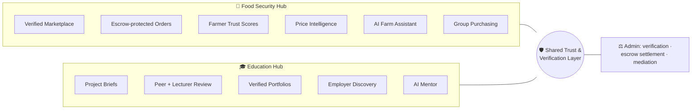
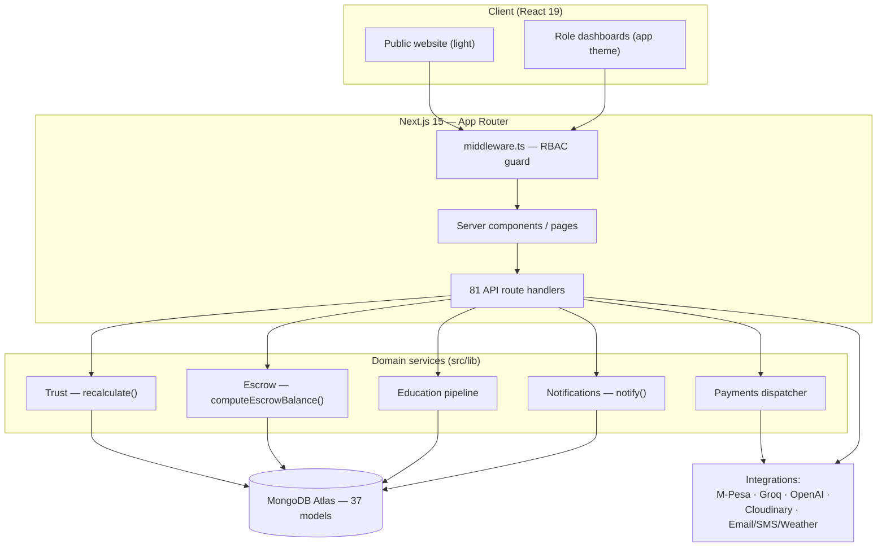
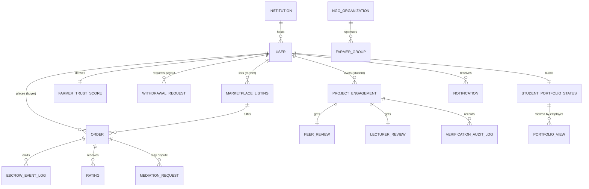
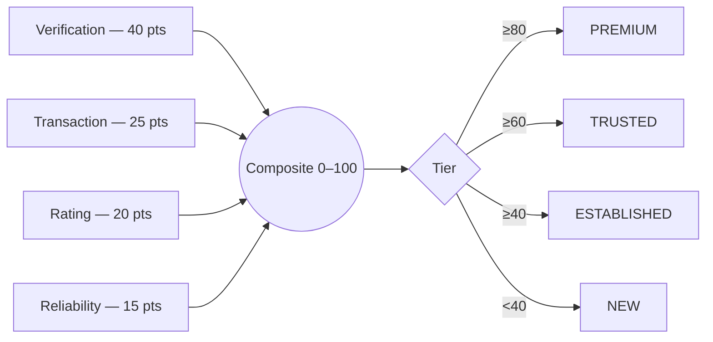
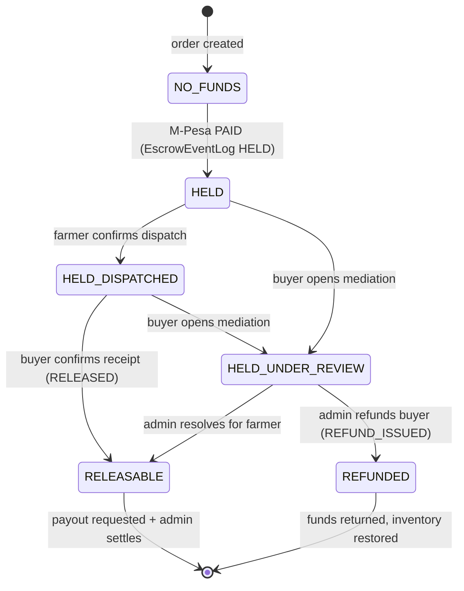
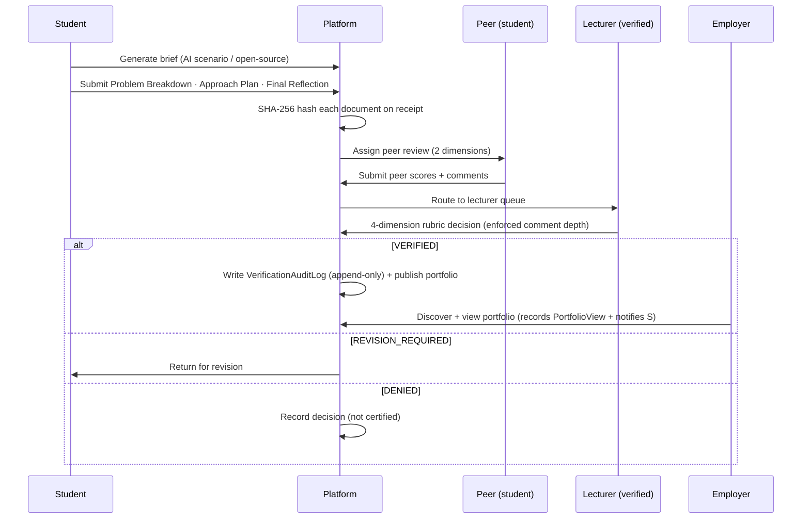
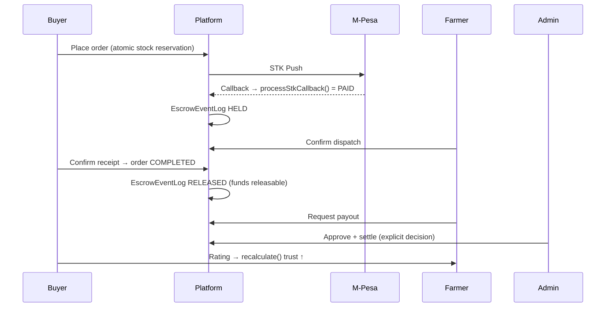
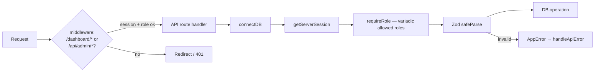
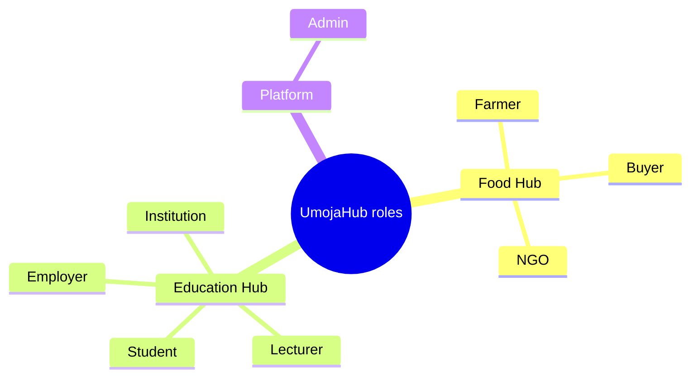

# UmojaHub — Mermaid Diagram Pack

A presentation-ready set of diagrams. The README embeds the core ones inline; this file
is the full pack (plus extras) for slides, design docs, and onboarding. All render on
GitHub and in any Mermaid-aware viewer.

---

## 1. System context — the two hubs and the shared trust layer

## 2. Technical architecture

## 3. Entity-relationship (core)

## 4. Trust score composition

## 5. Escrow lifecycle (state machine)

## 6. Project verification pipeline (sequence)

## 7. Order + escrow happy path (sequence)

## 8. RBAC & request flow

## 9. Roles overview

