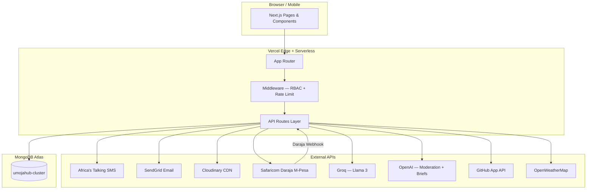
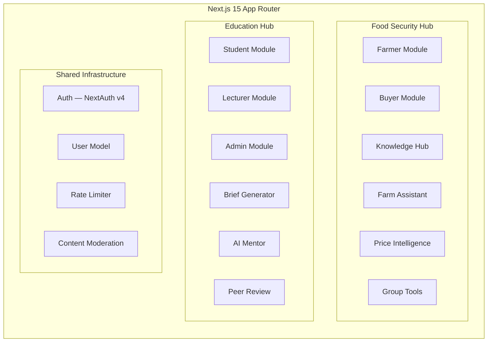
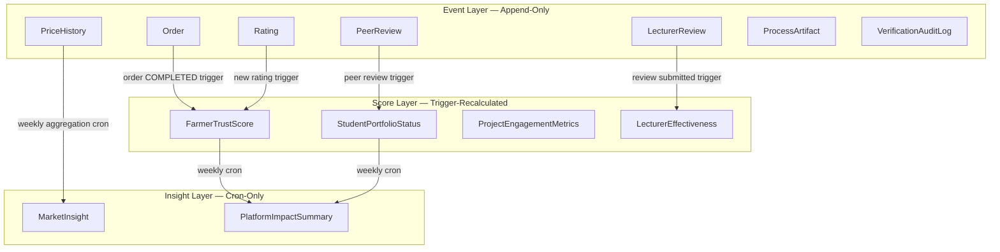
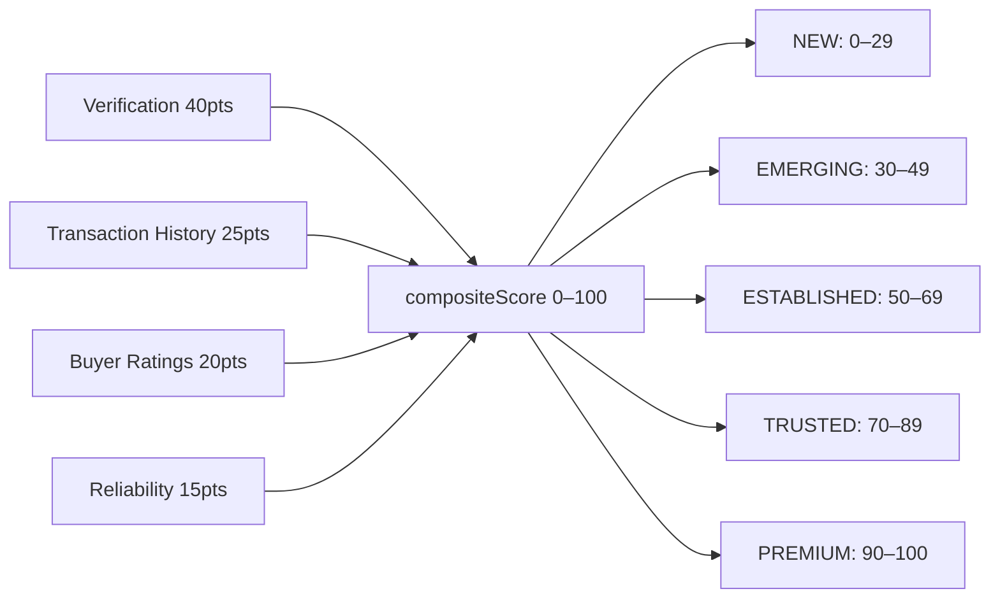
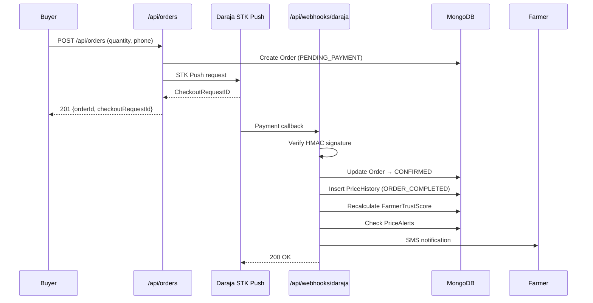
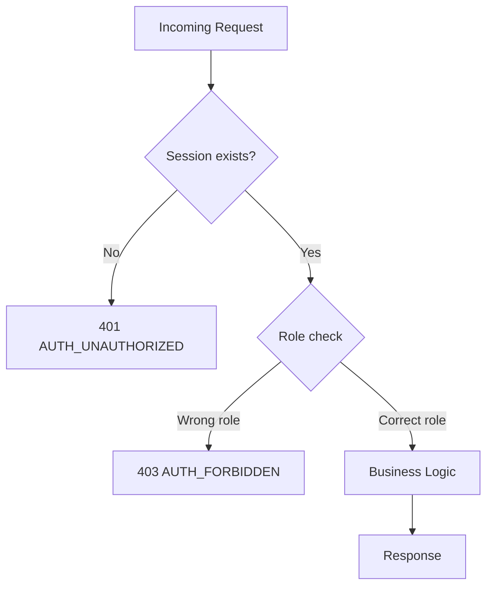
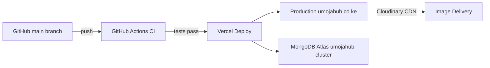

# UmojaHub — Architecture

> Modular Monolith · Next.js 15 App Router · MongoDB Atlas · Vercel

---

## System Overview



---

## Module Architecture



---

## Database Layer Architecture

UmojaHub uses a three-layer database architecture that separates concerns by data mutability:



### Layer Rules

| Layer | Write rule | Read rule |
|---|---|---|
| Event | Insert only — never update or delete | Any route |
| Score | Recalculated by triggers only — never on GET | Any route |
| Insight | Written by cron jobs only | Any route |

---

## Farmer Trust Score Model



Verification score caps at 40. No farmer reaches PREMIUM on verification alone — transaction history is required.

---

## Order Flow and Trigger Chain



---

## Authentication and RBAC



Five roles: `FARMER` · `BUYER` · `STUDENT` · `LECTURER` · `ADMIN`

Every protected API route uses `requireRole(session, Role.X)` before any database call.

---

## Security Controls

| Control | Implementation |
|---|---|
| Rate limiting | In-memory IP-based, 10 req/IP/min on auth routes |
| Content moderation | OpenAI Moderation API on marketplace descriptions |
| Input validation | Zod at every API boundary |
| Password storage | bcrypt, 12 rounds, `select: false` on all queries |
| CSP | No `unsafe-eval`, no external script sources |
| Daraja webhook | HMAC-SHA256 signature verification |
| File uploads | MIME type + size validation before Cloudinary |

---

## Cron Jobs

| Job | Schedule | Action |
|---|---|---|
| `price-alert-check` | Daily | Check PriceAlerts vs latest MarketInsight |
| `market-insight` | Weekly (Mon 06:00 EAT) | Aggregate PriceHistory into MarketInsight |
| `impact-summary` | Weekly (Mon 06:30 EAT) | Compute PlatformImpactSummary singleton |
| `cleanup-sessions` | Daily | Delete expired NextAuth sessions |

Cron routes are protected by `CRON_SECRET` header validation. Vercel Hobby plan restricts to daily minimum — `price-alert-check` runs daily.

---

## Deployment Architecture



- **Next.js functions**: Deploy as Vercel Edge Functions (middleware) and Serverless Functions (API routes)
- **Static pages**: Marketplace and Knowledge Hub pre-rendered with ISR (revalidate: 3600)
- **Database**: MongoDB Atlas M0 (free) → M10+ for production
- **Sessions**: JWT stored in secure httpOnly cookie

---

## 22 Mongoose Models

```
User                    — All 5 roles; polymorphic farmerData/studentData
MarketplaceListing      — Crop listings with trust-score-aware ranking
Order                   — M-Pesa payment lifecycle
FarmerTrustScore        — Composite trust metric (Event Layer trigger)
PriceHistory            — Append-only price event log
PriceAlert              — User-defined price threshold alerts
Rating                  — Buyer → Farmer transaction ratings
FarmerGroup             — Collective buying group
GroupOrder              — Group-level procurement order
VerifiedSupplier        — KEBS/PCPB/KEPHIS registered input suppliers
KnowledgeArticle        — Admin-published, source-attributed articles
ChatSession             — Farm Assistant conversation history
MarketInsight           — Weekly aggregated price intelligence (cron)
PlatformImpactSummary   — Platform metrics singleton (cron)
ProjectEngagement       — Student project lifecycle
PeerReview              — Student-to-student code review
LecturerReview          — Four-dimension rubric verification
StudentPortfolioStatus  — Tier and skills passport (trigger-recalculated)
VerificationAuditLog    — Immutable project state audit trail
BriefContextLibrary     — Admin-editable Kenyan industry contexts (singleton)
MentorSession           — AI Mentor conversation history
LecturerEffectiveness   — Reviewer quality metrics (trigger-recalculated)
```
